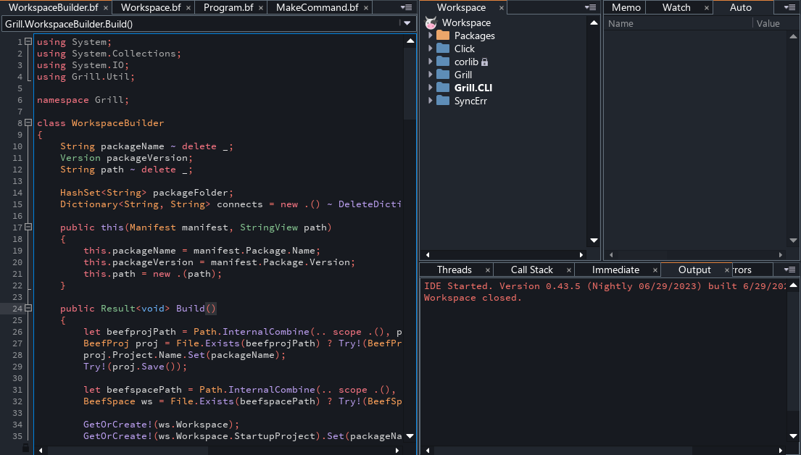
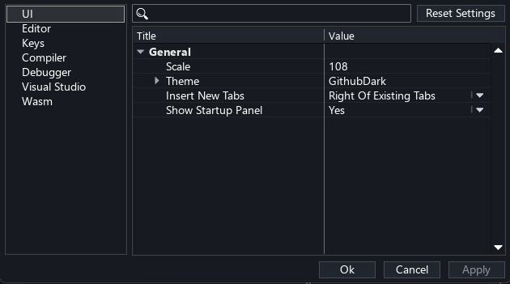

# Github Dark theme for Beef IDE

## Installation

Clone the repository into `%BeefPath%/bin/themes/GithubDark`.

Open `File > Preferences > Settings` in the IDE. In the UI tab set theme to `GithubDark`.
